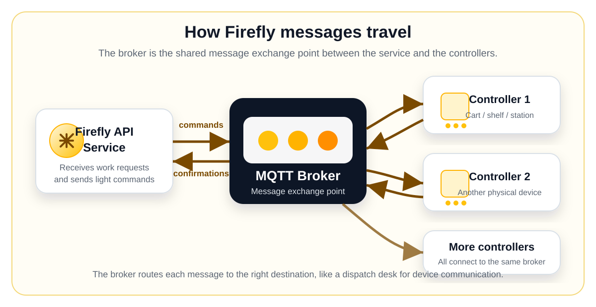
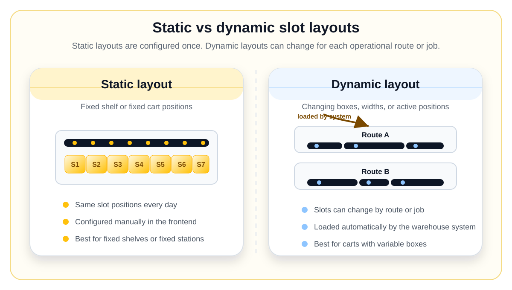

# Firefly Frontend User Guide

## Document And Guide Version

| Item | Value |
|---|---|
| Document version | 0.2 |
| Document date | 2026-07-01 |
| Guide scope | Frontend use for warehouse operations and maintenance |
| Guide status | Draft with screenshots and diagram placeholders |
| Product | Macrolet Firefly API Service |

This guide explains how to use the Firefly API frontend to configure, supervise, test, and diagnose Firefly controllers in a warehouse environment.

It is written for warehouse supervisors, key users, maintenance staff, support staff, and project teams. It assumes the reader is comfortable with basic warehouse systems and basic network information such as IP addresses, ports, switches, and routers. It does not assume that the reader is a programmer or IT specialist.

## What Firefly Does

Firefly is a light-guided picking system. A Firefly controller turns LEDs on and off to guide an operator to the correct physical position: a tote, box, slot, shelf, or cart position.

The Firefly API Service is the local application that sits between warehouse software and the Firefly controllers. The frontend is the web screen used by supervisors and maintenance teams to configure the system and check whether it is working correctly.

In simple terms:

| Part | What it means |
|---|---|
| Firefly controller | The physical electronic controller connected to LED strips. |
| Firefly API Service | The local service that manages controllers and receives commands from other systems. |
| Frontend | The browser interface described in this guide. |
| Warehouse system | The customer system that decides which slot should light up. |
| LED strip | The physical strip of LEDs installed on carts, shelves, or stations. |

You normally open the frontend from a browser with a URL like:

```text
http://<firefly-api-host>:8000/
```

The exact address depends on where the Firefly API Service is installed.

## Main Screens

The frontend is organized around a few practical tasks.

| Screen | Used for |
|---|---|
| Dashboard | Quick health overview of all configured controllers. |
| MQTT Broker | Communication settings between the service and the controllers. |
| Devices | List of Firefly controllers known by the system. |
| Device detail | Configuration and live status of one controller. |
| LED States | Light colors and flashing behavior. |
| Segments | Physical LED strip layout. |
| Slots | Logical positions inside a LED strip, such as boxes or tote spaces. |
| Command Presets | Reusable combinations for manual testing. |
| Manual Test | Send a test light command to one or more slots. |
| Event Log | Detailed history of messages, errors, timeouts, and acknowledgements. |

## Core Concepts

### Devices

A device is one Firefly controller installed in the warehouse. It may be mounted on a cart, a workstation, a put wall, a shelf area, or another physical location.

In the frontend, each device should be configured with a name that matches the controller. A display name can be used to make it easier for users to recognize the physical location.

Good display names are operational names, for example:

| Example | Why it helps |
|---|---|
| `Cart 03` | Easy to match with a labeled cart. |
| `Packing Station 2` | Easy for operators and supervisors to identify. |
| `Put Wall North` | Describes the physical location. |

### MQTT Broker

MQTT is the communication method used by Firefly controllers to talk with the Firefly API Service.

For a non-technical user, the easiest way to understand it is this: the MQTT broker is the message exchange point. Controllers and the Firefly API Service do not need to speak directly to each other all the time. Instead, they connect to the same broker. The broker receives messages from one side and delivers them to the other side.

A warehouse analogy is a dispatch desk:

| Warehouse analogy | Firefly meaning |
|---|---|
| A supervisor sends an instruction to a dispatch desk. | The Firefly API Service sends a command to the broker. |
| The dispatch desk forwards the instruction to the right operator. | The broker forwards the command to the right controller. |
| The operator confirms the instruction was received. | The controller sends an acknowledgement back through the broker. |

The MQTT Broker screen is where this message exchange point is configured. Most users do not need to change it often. It is normally configured during installation or maintenance.

<figure class="concept-figure">
  
  <figcaption>The Firefly API Service and the controllers connect to the same MQTT broker. The broker routes commands and confirmations between them.</figcaption>
</figure>

### LED States

An LED state is a saved light behavior. It defines what the operator sees: color, timing, flashing, fading, and repetition.

Examples:

| LED state | Typical meaning |
|---|---|
| `PICK` | The operator should pick from this position. |
| `PUT` | The operator should place an item in this position. |
| `ERROR` | Something needs attention. |
| `OFF` | Turn the slot off. |

The names depend on the installation. They should be agreed with the operations and integration teams, because other systems may refer to them.

### Segments

A segment is a physical LED strip, or a defined part of a physical LED strip, connected to a Firefly controller.

For example, a cart may have one LED strip per level. Each level can be configured as a segment. The system needs this information so it knows where each strip starts and ends.

<figure class="concept-figure">
  
  <figcaption>Example segment layout: each physical LED strip is configured as a segment and addressed by channel number and segment number within the channel.</figcaption>
</figure>

The important idea is simple: segments describe the physical LED layout.

### Slots

A slot is the logical place the operator interacts with: a tote position, box position, shelf position, or cart location.

Slots sit inside segments. If the segment is the LED strip, the slots are the useful positions along that strip.

Example:

| Physical setup | Firefly concept |
|---|---|
| One LED strip on the top level of a cart | Segment |
| Six tote positions along that strip | Six slots |
| The third tote position | One slot with its own identifier |

### Static And Dynamic Layouts

A static layout is a layout that does not change during normal operation. For example, a fixed shelf with ten always-present positions is usually static. Slots for static layouts are configured in the frontend.

A dynamic layout is a layout that may change from one operation to the next. For example, a cart where the number or width of boxes changes for each route may be dynamic. Slots for dynamic layouts are loaded by the warehouse system through the Firefly public API.

| Layout type | Best for | Where slots are configured |
|---|---|---|
| Static | Fixed shelves, fixed put walls, fixed cart positions. | In the frontend. |
| Dynamic | Changing cart layouts, variable box sizes, changing active positions. | By the warehouse system. |

For most users, the main rule is: if a segment is dynamic, the frontend shows the slots but does not allow manual editing of those slots.

<figure class="concept-figure">
  
  <figcaption>Static layouts keep the same slot positions. Dynamic layouts can change by route, job, box size, or active position list.</figcaption>
</figure>

## Recommended Setup Order

For a new installation, configure the system in this order:

1. Configure the MQTT broker connection.
2. Restart the Firefly API Service if the broker settings were changed.
3. Create the LED states used by the installation.
4. Add the Firefly devices.
5. Configure the physical segments for each device.
6. Configure static slots where the layout is fixed.
7. Reset devices after LED state or segment changes.
8. Reinitialize devices after slot changes.
9. Use Manual Test to verify the physical lights.
10. Use Dashboard and Event Log to confirm the system is healthy.

## Dashboard

The Dashboard is the first screen to check when you want to know whether the Firefly fleet is healthy.

<figure class="screenshot-figure">
  
  <figcaption>Dashboard page with fleet status, device list, and recent errors or timeouts.</figcaption>
</figure>

Use it to answer questions such as:

| Question | Where to look |
|---|---|
| Are the controllers online? | Fleet status cards and device list. |
| Which device needs attention? | Devices table and status column. |
| Were there recent failures? | Recent errors and timeouts section. |
| Is a problem affecting one device or many? | Compare statuses across the device list. |

Status meanings:

| Status | Meaning | Typical action |
|---|---|---|
| `online` | The device is connected and has accepted its slot configuration. | No action needed. |
| `offline` | The device is not currently communicating as expected. | Check power, network, broker, and event log. |
| `unknown` | The service does not yet have enough recent information. | Wait briefly, then check the device detail and event log. |
| `register_error` | The device tried to register but configuration was not accepted. | Check device name, LED states, and segment setup. |

## MQTT Broker Page

The MQTT Broker page contains the connection settings for the message exchange point used by the Firefly API Service and the controllers.

<figure class="screenshot-figure">
  
  <figcaption>MQTT Broker page used to configure and test the broker connection.</figcaption>
</figure>

Most installations have one broker configuration. The important fields are:

| Field | Meaning |
|---|---|
| Name | Friendly name for the broker configuration. |
| Host | Broker address. This may be an IP address or server name. |
| Port | Broker port. The common non-TLS MQTT port is `1883`. |
| Username | Optional login user for the broker. |
| Password | Optional login password for the broker. Existing values may be hidden for security. |
| Use TLS | Enables encrypted broker communication when required by the installation. |
| Client ID | Optional identifier used by the service when connecting to the broker. |

Actions:

| Action | Use it when |
|---|---|
| Test connection | You want to check whether the service can reach the broker. |
| Save or edit broker | Broker settings changed during installation or maintenance. |
| Delete broker | The broker configuration is no longer used. |

After changing broker settings, restart the Firefly API Service. The running service loads broker settings at startup.

## Devices Page

The Devices page lists the Firefly controllers configured in the system.

<figure class="screenshot-figure">
  
  <figcaption>Devices page with configured controllers, status, firmware, MAC address, and last keepalive.</figcaption>
</figure>

To add a device, use Add device.

<figure class="screenshot-figure">
  
  <figcaption>Add Device dialog. The device name must match the name used by the physical controller.</figcaption>
</figure>

Fields:

| Field | Meaning |
|---|---|
| Device name | The exact controller name used by the physical device. |
| Display name | Friendly name shown to users. |
| Description | Optional note about location, purpose, or installation details. |
| MQTT broker | Broker configuration used by this device. |

The device name is important. If it does not match the physical controller, the controller may not appear online under the expected device.

## Device Detail Page

Open a device from the Devices page to see its live status and configuration tabs.

The live status area is useful during commissioning and troubleshooting. It shows whether the device has registered, when it last sent a keepalive, and whether it has accepted the current slot layout.

Important actions:

| Action | Use when | What happens |
|---|---|---|
| Reinitialize | Slots changed. | Sends the current slot layout to the controller again. |
| Reset device | LED states or segments changed, or the controller needs a restart. | The controller resets and registers again. |
| Stop actor | Support or maintenance is isolating a runtime issue. | The service stops managing that device until restarted. |
| Start actor | The actor was stopped. | The service resumes managing that device. |

For normal users, the most common actions are Reset device and Reinitialize.

## Segments Tab

The Segments tab describes the physical LED strips connected to a device.

<figure class="screenshot-figure">
  
  <figcaption>Segments tab showing channel, segment number, LED range, LED count, and mode.</figcaption>
</figure>

To add a segment, use Add segment.

<figure class="screenshot-figure">
  
  <figcaption>Add Segment dialog used to define the physical LED range and choose static or dynamic mode.</figcaption>
</figure>

Fields:

| Field | Meaning |
|---|---|
| Channel | The controller output channel where the strip is connected. |
| Segment in channel | The strip number within that channel. |
| First LED | The first LED number included in the segment. |
| Last LED | The last LED number included in the segment. |
| Mode | Static or dynamic layout behavior. |

Operational notes:

| Situation | What to do |
|---|---|
| You added or changed a segment. | Reset the device so it registers with the new layout. |
| The system rejects the segment. | Check for overlapping LED ranges or invalid LED numbers. |
| You want to change a segment to dynamic. | Remove its manually configured slots first. |
| You want to delete a segment. | Delete its slots first. |

## Slots Tab

The Slots tab defines the positions that can light up inside static segments.

<figure class="screenshot-figure">
  
  <figcaption>Slots tab showing slot index, external slot ID, segment, position, LEDs, and label.</figcaption>
</figure>

To add a slot, use Add slot.

<figure class="screenshot-figure">
  
  <figcaption>Add Slot dialog used to create a logical position inside a static segment.</figcaption>
</figure>

Fields:

| Field | Meaning |
|---|---|
| External slot ID | The business identifier used by the warehouse system. |
| Label | Optional friendly label for users. |
| Segment | Physical segment where the slot is located. |
| Position | Order of the slot inside the segment. |
| Number of LEDs | How many LEDs are assigned to this slot. |

After adding, editing, deleting, or importing static slots, reinitialize the device.

Import and export are useful for fixed installations with many slots. Export creates an Excel file that can be reviewed or used as a backup. Import replaces the current static slot layout for the device, so it should be used carefully.

Dynamic slots may appear in the table, but they are managed by the warehouse system and cannot be edited manually from this tab.

## LED States Page

The LED States page defines the light behaviors available in the system.

<figure class="screenshot-figure">
  
  <figcaption>LED States page showing configured colors and timing behavior.</figcaption>
</figure>

To add a LED state, use Add LED state.

<figure class="screenshot-figure">
  
  <figcaption>Add LED State dialog used to define color and timing values.</figcaption>
</figure>

Important fields:

| Field | Meaning |
|---|---|
| Name | The state name used by users and integrations. |
| RGB | The light color. |
| Color1 on | How long the color stays on. |
| Fade up | How long the light takes to fade in. |
| Fade down | How long the light takes to fade out. |
| Repeat after | Delay before repeating the effect. |
| Repetitions | Number of times the effect repeats. |

After creating, editing, or deleting LED states, reset affected devices so they receive the updated list.

## Command Presets Page

Command presets are saved manual-test combinations. They make repeated testing easier.

<figure class="screenshot-figure">
  
  <figcaption>Command Presets page with saved combinations of LED state, pattern, and pattern value.</figcaption>
</figure>

To add a preset, use Add preset.

<figure class="screenshot-figure">
  
  <figcaption>Add Preset dialog used to create a reusable manual-test command.</figcaption>
</figure>

A preset contains:

| Field | Meaning |
|---|---|
| Name | Friendly name, such as `Pick green` or `Error red`. |
| LED state | The light behavior to use. |
| Pattern | How the light is applied to the slot. |
| Pattern value | Extra numeric value used by some patterns. |

Presets do not send anything to devices by themselves. They are shortcuts used from Manual Test.

## Manual Test Page

Manual Test lets a user send a light command to one or more slots without using the warehouse system.

<figure class="screenshot-figure">
  
  <figcaption>Manual Test page used to select a device, slots, LED state, pattern, and timeout.</figcaption>
</figure>

Use Manual Test during:

| Situation | Why it helps |
|---|---|
| Commissioning | Confirms each physical slot lights up correctly. |
| Maintenance | Checks whether a repaired controller or strip responds. |
| Support | Separates frontend/controller problems from warehouse-system problems. |
| Training | Shows users what each LED state looks like. |

Typical flow:

1. Select a device.
2. Select one or more slots.
3. Optionally select a command preset.
4. Select the LED state and pattern.
5. Send the test.
6. Check the result in Recent outcomes.

A successful result means the device acknowledged the command. A failed or timed-out result means the service did not receive the expected confirmation from the controller.

## Event Log Page

The Event Log is the detailed history of what the Firefly API Service has seen and done.

<figure class="screenshot-figure">
  
  <figcaption>Event Log page with filters and expandable event details.</figcaption>
</figure>

It is mainly used for diagnosis. A supervisor may use it to identify when a problem started; maintenance or support staff may use it to understand the exact failure.

Common event meanings:

| Event | Plain-language meaning |
|---|---|
| Register request received | A controller introduced itself to the service. |
| Register response sent | The service answered with configuration. |
| Init slots sent | The service sent slot layout to the controller. |
| Update slot state sent | The service sent a light command for selected slots. |
| Reset sent | The service asked the controller to reset. |
| ACK received | The controller confirmed a command. |
| Error received | The controller reported a problem. |
| Keepalive received | The controller reported that it is still alive. |
| Timeout | The expected confirmation did not arrive in time. |
| Retry | The service tried sending a command again. |

Use the filters to focus on one device or one type of event.

## Applying Changes

Different changes require different follow-up actions.

| Change | Follow-up action |
|---|---|
| MQTT broker settings | Restart the Firefly API Service. |
| Device display name or description | No controller action required. |
| LED state changes | Reset affected devices. |
| Segment changes | Reset affected devices. |
| Static slot changes | Reinitialize affected device. |
| Dynamic layout loaded by warehouse system | The system sends the new layout automatically. |
| Command preset changes | No controller action required. |

A useful rule of thumb:

| If you changed... | Then... |
|---|---|
| The physical layout or LED behaviors | Reset the device. |
| The slots inside an existing layout | Reinitialize the device. |
| Broker communication settings | Restart the service. |

## Troubleshooting Guide

| Situation | What it usually means | What to check first |
|---|---|---|
| A device is offline. | The service is not receiving expected communication from it. | Power, network, broker, and Event Log. |
| A device stays unknown. | The service has not received enough information yet. | Wait briefly, then check Event Log and broker. |
| A device shows register error. | The device tried to connect but configuration was not accepted. | Device name, LED states, segment layout. |
| Manual Test times out. | The controller did not confirm the command in time. | Device status, broker connection, recent events. |
| Slots cannot be edited. | The segment is dynamic or no static segment exists. | Segment mode. |
| A segment cannot become dynamic. | It still has manually configured slots. | Delete those slots first. |
| Imported slots fail. | The spreadsheet does not match the configured segments or contains invalid rows. | Segment references, duplicate IDs, slot sizes. |

## Good Operational Practices

1. Use display names that match real warehouse labels.
2. Keep a record of which controller is installed in each physical location.
3. Agree LED state names with operations before using them in production.
4. Configure and verify segments before configuring slots.
5. Use static layouts for fixed physical positions.
6. Use dynamic layouts only when the warehouse system controls the layout.
7. Export static slot layouts after commissioning and keep the files as backups.
8. Use Manual Test before involving the warehouse integration.
9. Use Dashboard first for a quick health check, then Event Log for detail.
10. After changes, apply the right action: restart service, reset device, or reinitialize device.

## Change History

| Document version | Date | Notes |
|---|---|---|
| 0.1 | 2026-07-01 | Initial frontend user guide. |
| 0.2 | 2026-07-01 | Reworked for non-programmer operational users, added screenshots and concept diagrams. |
